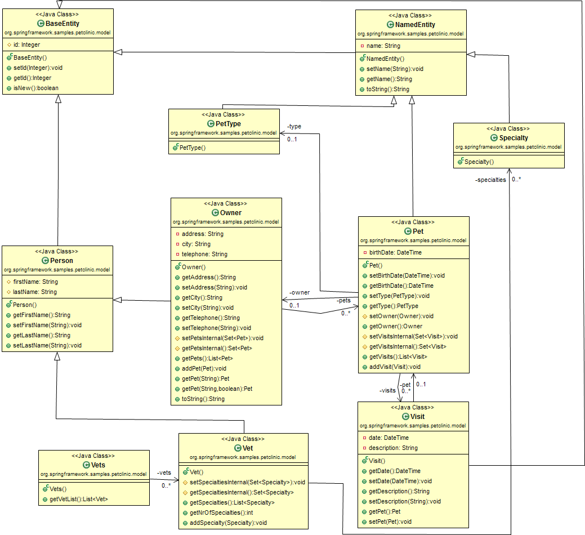
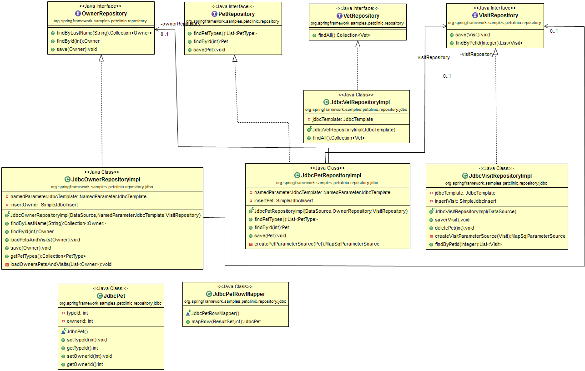
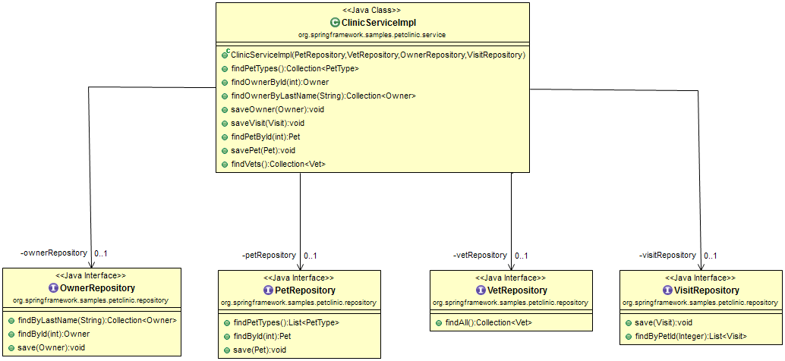
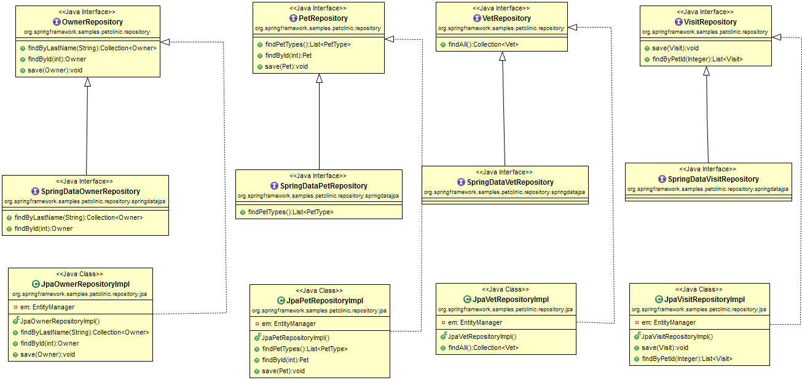

spring-petclinic-study
======================

> Just petclinic of Analysis document. 

##类图

- model

- repository

- service

- jpa

##架构

演讲中的结构画的图称得上一图千言,不过还是要简单的总结一下

- 视图层

(?):JSP自定义标签或者Thymeleaf
css+(允许maven管理css和js类库):webjar+(Datatables,boostrap theme,pdf export..):Dandelion

- 控制层(难点)

注解和(?):bean validation

- service(难点)

(?):缓存注解和(?):事务注解

- 仓库

Spring Data JPA+Default JPA+jdbc

##HSQL 

适合演示,因为每次的数据库都需要重新建立.

##异常处理方式

`SimpleMappingExceptionResolver`统一管理

